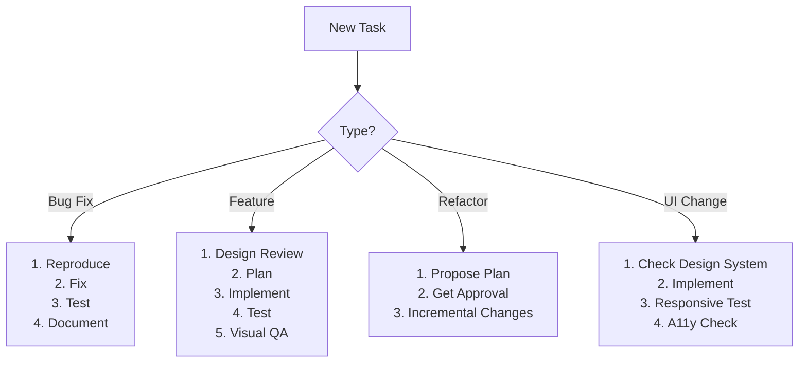

# CLAUDE.md - AI Agent Guide for BeBitter Portfolio

> 🤖 **For AI Agents**: This document provides comprehensive guidance for working with the BeBitter portfolio codebase. Follow these instructions precisely to maintain code quality, performance, and design standards.

## Table of Contents

1. [How to Use This Guide](#how-to-use-this-guide)
2. [Project Overview](#project-overview)
3. [Architecture & Tech Stack](#architecture--tech-stack)
4. [Development Workflow](#development-workflow)
5. [Code Quality Standards](#code-quality-standards)
6. [Visual Development & Design System](#visual-development--design-system)
7. [Design Review & Visual QA](#design-review--visual-qa)
8. [Testing Strategy](#testing-strategy)
9. [Performance Optimization](#performance-optimization)
10. [Accessibility & SEO](#accessibility--seo)
11. [Error Handling Patterns](#error-handling-patterns)
12. [Analytics & Monitoring](#analytics--monitoring)
13. [Deployment Process](#deployment-process)
14. [Repository Hygiene & Security](#repository-hygiene--security)
15. [Troubleshooting](#troubleshooting)
16. [Appendices](#appendices)

---

## How to Use This Guide

### AI Agent Operating Rules

**CRITICAL: Always follow these guardrails:**

1. **Package Management**: Always run `pnpm install` if `pnpm-lock.yaml` changes
2. **Code Changes**: Prefer minimal diffs, small PRs, and reversible changes
3. **Security**: NEVER commit secrets, `.env` files, or backup files (`*.bak`, `*.backup`, `*~`)
4. **Design Compliance**: Confirm all UI changes against `/context/design-principles-example.md`
5. **Planning**: Propose a plan and get approval before large refactors
6. **Documentation**: Document deviations and TODOs inline and in PR descriptions
7. **Testing**: Run `pnpm lint` and `pnpm build` before committing
8. **Performance**: Check bundle size impact with `pnpm analyze:bundle` for significant changes

### Quick Decision Tree



---

## Project Overview

**BeBitter** is a modern, performant portfolio website for Bernardo Gomes - Full-Stack Developer & Designer.

### Key Characteristics
- **Production URL**: https://bebitterbebetter.com.br
- **Performance Target**: Lighthouse 95+/100
- **Stack**: React 18 + TypeScript + Vite + Tailwind CSS
- **Package Manager**: pnpm (REQUIRED - do not use npm/yarn)
- **Languages**: PT-BR (default) and EN with dynamic switching
- **Hosting**: Hostinger with FTP deployment

### Project Goals
1. Showcase portfolio with excellent UX
2. Maintain sub-2.5s LCP on 4G networks
3. Full accessibility (WCAG 2.1 AA)
4. SEO optimized for Brazilian and global markets
5. Offline-capable with Service Worker

---

## Architecture & Tech Stack

### Entry Point & Provider Stack

**CRITICAL**: Maintain this exact provider hierarchy (outer → inner):

```typescript
// src/main.tsx → src/App.tsx
<ErrorBoundary>
  <QueryClientProvider>
    <ThemeProvider>
      <LanguageProvider>
        <TooltipProvider>
          <BrowserRouter>
            {/* App Content */}
          </BrowserRouter>
        </TooltipProvider>
      </LanguageProvider>
    </ThemeProvider>
  </QueryClientProvider>
</ErrorBoundary>
```

### Project Structure

```text
src/
├── components/           # Reusable components
│   ├── ui/              # shadcn/ui components (DO NOT MODIFY DIRECTLY)
│   ├── Analytics.tsx    # Google Analytics 4 integration
│   ├── WebVitals.tsx    # Core Web Vitals monitoring
│   ├── ErrorBoundary.tsx # Global error handling
│   ├── ServiceWorkerManager.tsx # SW lifecycle
│   ├── SEOHead.tsx      # Dynamic meta tags
│   ├── Header.tsx       # Navigation header
│   ├── Footer.tsx       # Site footer
│   ├── ThemeToggle.tsx  # Dark/light mode switch
│   └── LanguageToggle.tsx # PT/EN switcher
├── pages/               # Route components (lazy loaded)
│   ├── Index.tsx        # Homepage - portfolio showcase
│   ├── Now.tsx          # /now - current status page
│   └── NotFound.tsx     # 404 error page
├── contexts/            # React contexts
│   ├── LanguageContext.tsx # i18n implementation
│   └── ProjectsContext.tsx # Projects state
├── constants/           # Static data
│   ├── translations.ts  # PT/EN translations
│   └── config.ts        # App configuration
├── hooks/               # Custom React hooks
│   ├── useGitHubProjects.ts # GitHub API integration
│   └── useScrollAnimation.ts # Scroll-based animations
├── lib/                 # Utilities
│   └── utils.ts         # cn() helper for Tailwind
└── utils/               # Helper functions
    └── performance.ts   # Web Vitals helpers
```

### State Management

**Patterns**:
- **Local State**: useState for component-level state
- **Global State**: React Context (Language, Theme)
- **Server State**: TanStack Query with these settings:
  ```typescript
  {
    staleTime: 5 * 60 * 1000,        // 5 minutes
    gcTime: 10 * 60 * 1000,           // 10 minutes
    retry: 1,                         // Single retry
    refetchOnWindowFocus: false
  }
  ```

### Routing

- **React Router v6** with lazy loading
- Routes defined in `src/App.tsx`
- All pages wrapped in Layout component
- Code splitting per route

### Internationalization

**Custom i18n implementation** (not using i18next):
- **Languages**: Portuguese (pt) default, English (en)
- **Implementation**: `src/contexts/LanguageContext.tsx`
- **Translations**: `src/constants/translations.ts`
- **Detection**: Browser language with localStorage persistence
- **Usage**: `const { t, language, setLanguage } = useLanguage();`

### Build Configuration

**Vite Config** (`vite.config.ts`):
- Port: 8080 (dev server)
- Host: "::" (IPv6 all interfaces)
- Alias: `@/` → `src/`
- Plugins: react-swc, dyad-component-tagger, compression (gzip + brotli)
- Manual chunks: vendor, ui, router, query

---

## Development Workflow

### Prerequisites

```bash
# Verify environment
node --version  # Must be 18+
pnpm --version  # Required package manager
```

### Command Palette

| Command | Purpose | When to Use |
|---------|---------|------------|
| `pnpm dev` | Start dev server on http://localhost:8080 | Daily development |
| `pnpm dev --host` | Expose on network | Mobile testing |
| `pnpm build` | Production build | Before deployment |
| `pnpm build:dev` | Development build | Debug production issues |
| `pnpm build:analyze` | Build + bundle analysis | Performance audit |
| `pnpm preview` | Preview production build | Final testing |
| `pnpm preview:network` | Network preview | Cross-device testing |
| `pnpm lint` | Run ESLint | Before commits |
| `pnpm lint:fix` | Auto-fix linting | Clean up code |
| `pnpm test` | Run tests with Vitest | Verify changes |
| `pnpm test:coverage` | Coverage report | Quality check |
| `pnpm analyze:bundle` | Visualize bundle | Optimize imports |
| `pnpm performance:audit` | Lighthouse reminder | Manual step |
| `./deploy.sh` | Deploy to production | Ship to Hostinger |

### First-Time Setup

```bash
# Clone and install
git clone https://github.com/bernardopg/BeBitter.git
cd BeBitter
pnpm install

# Environment setup
cp .env.example .env.local
# Edit .env.local with your values:
# VITE_GA_TRACKING_ID=G-XXXXXXXXXX
# VITE_SITE_URL=https://bebitterbebetter.com.br

# Start development
pnpm dev
```

### Feature Development Flow

1. **Plan**: Check existing patterns in codebase
2. **Branch**: `git checkout -b feature/description`
3. **Implement**: Follow patterns below
4. **Lint**: `pnpm lint:fix`
5. **Build**: `pnpm build`
6. **Test**: Manual + automated tests
7. **Visual QA**: Check all viewports
8. **Bundle Check**: `pnpm analyze:bundle`
9. **PR**: Include screenshots for UI changes

---

## Code Quality Standards

### TypeScript Guidelines

```typescript
// ✅ GOOD: Explicit return types for exported functions
export function calculateScore(value: number): number {
  return value * 2;
}

// ✅ GOOD: Proper typing for components
interface ButtonProps {
  label: string;
  onClick: () => void;
  variant?: 'primary' | 'secondary';
}

// ❌ BAD: Any types or missing types
export function process(data: any) { // Avoid any
  return data.map(item => item);
}
```

**Configuration Notes**:
- `noImplicitAny: false` in tsconfig (legacy, don't rely on it)
- Prefer explicit types for new code
- Use `@/` import alias for src imports

### Component Conventions

```typescript
// Place in src/components/ for app-specific
export function ProjectCard({ project }: ProjectCardProps) {
  const { t } = useLanguage();
  
  return (
    <Card className={cn(
      "hover:shadow-lg transition-shadow",
      project.featured && "border-primary"
    )}>
      {/* Content */}
    </Card>
  );
}

// UI primitives in src/components/ui/ (from shadcn)
// DO NOT modify these directly - use composition
```

### File Naming

- Components: `PascalCase.tsx`
- Utilities: `camelCase.ts`
- Constants: `UPPER_SNAKE_CASE` or `camelCase`
- Tests: `ComponentName.test.tsx` (colocated in `__tests__` folder)

### Import Order

```typescript
// 1. React/Next
import React, { useState, useEffect } from 'react';

// 2. External libraries
import { useQuery } from '@tanstack/react-query';
import { motion } from 'framer-motion';

// 3. Internal - absolute paths
import { Button } from '@/components/ui/button';
import { useLanguage } from '@/contexts/LanguageContext';

// 4. Internal - relative paths
import { ProjectCard } from './ProjectCard';

// 5. Types
import type { Project } from '@/types';

// 6. Styles/assets (if any)
import './styles.css';
```

### Commit Messages

Format: `scope: description`

Examples:
- `feat: add contact form validation`
- `fix: correct mobile menu z-index`
- `perf: lazy load project images`
- `docs: update deployment guide`
- `style: format with prettier`
- `refactor: extract analytics helpers`
- `test: add ProjectCard unit tests`
- `chore: update dependencies`

### PR Guidelines

1. **Title**: Clear, action-oriented
2. **Description**: Include:
   - What changed and why
   - Screenshots for UI changes
   - Testing performed
   - Bundle size impact (if significant)
3. **Size**: Prefer < 400 lines changed
4. **Reviews**: Request from team

---

## Visual Development & Design System

### Design Principles

**Reference**: `/context/design-principles-example.md`

Core principles:
1. **Users First**: Prioritize UX in every decision
2. **Meticulous Craft**: Pixel-perfect implementation
3. **Speed**: Fast interactions and load times
4. **Simplicity**: Clean, uncluttered interface
5. **Consistency**: Uniform design language

### Tailwind CSS Usage

```typescript
// ✅ GOOD: Using design tokens via Tailwind
<div className="p-4 md:p-6 lg:p-8">
  <h2 className="text-2xl font-semibold text-foreground">
    Title
  </h2>
  <p className="mt-2 text-muted-foreground">
    Description
  </p>
</div>

// ✅ GOOD: Responsive design
<div className="grid grid-cols-1 md:grid-cols-2 lg:grid-cols-3 gap-4">

// ❌ BAD: Arbitrary values (use design tokens)
<div className="p-[13px] text-[#456789]"> // Use p-3 and text-primary
```

### Dark Mode Implementation

```typescript
// Using conditional classes
<div className={cn(
  "bg-background text-foreground",
  "dark:bg-zinc-900 dark:text-zinc-100"
)}>

// CSS variables (defined in globals.css)
:root {
  --background: 0 0% 100%;
  --foreground: 240 10% 3.9%;
}

.dark {
  --background: 240 10% 3.9%;
  --foreground: 0 0% 98%;
}
```

### Component Examples

**Themed Button with shadcn/ui**:
```typescript
import { Button } from '@/components/ui/button';
import { cn } from '@/lib/utils';

export function CTAButton({ 
  children, 
  className,
  ...props 
}: ButtonProps) {
  return (
    <Button
      className={cn(
        "bg-primary hover:bg-primary/90",
        "transition-colors duration-200",
        className
      )}
      {...props}
    >
      {children}
    </Button>
  );
}
```

**Responsive Image**:
```typescript

```

### Spacing Scale

Use consistent spacing based on 8px unit:
- `space-1` = 4px
- `space-2` = 8px
- `space-3` = 12px
- `space-4` = 16px
- `space-6` = 24px
- `space-8` = 32px

### Adding New shadcn/ui Components

```bash
# Don't use shadcn CLI in this project
# Instead, manually copy from ui.shadcn.com
# Place in src/components/ui/
# Ensure it uses our CSS variables
```

---

## Design Review & Visual QA

### Design Review Checklist

Before merging any UI changes:

#### Visual Consistency
- [ ] Follows design tokens (colors, spacing, typography)
- [ ] Consistent with existing patterns
- [ ] Proper dark mode implementation
- [ ] Icons from Lucide React only

#### Responsive Design
- [ ] Mobile (375px) - Touch-optimized
- [ ] Tablet (768px) - Proper layout
- [ ] Desktop (1440px) - Full experience
- [ ] No horizontal scroll at any breakpoint

#### Accessibility
- [ ] Color contrast ≥ 4.5:1 (WCAG AA)
- [ ] Keyboard navigable
- [ ] Focus states visible
- [ ] Screen reader friendly
- [ ] Alt text for images

#### Performance
- [ ] Images optimized (WebP preferred)
- [ ] Lazy loading implemented
- [ ] No layout shift (CLS < 0.1)
- [ ] Bundle size acceptable

#### States
- [ ] Loading state
- [ ] Empty state
- [ ] Error state
- [ ] Success feedback

### Visual QA Process

1. **Build and Preview**:
   ```bash
   pnpm build && pnpm preview
   ```

2. **Test Viewports**:
   - Mobile: 375px
   - Tablet: 768px
   - Desktop: 1440px

3. **Theme Testing**:
   - Toggle light/dark mode
   - Check contrast in both

4. **Language Testing**:
   - Switch PT ↔ EN
   - Verify text fits layouts

5. **Interaction Testing**:
   - Hover states
   - Focus states
   - Click feedback
   - Form validation

6. **Cross-Browser**:
   - Chrome
   - Firefox
   - Safari (if available)
   - Mobile browsers

### PR Visual Documentation

Include in PR description:
```markdown
## Visual Changes

### Desktop (1440px)


### Mobile (375px)


### Dark Mode


### Lighthouse Score
- Performance: 95
- Accessibility: 98
- Best Practices: 100
- SEO: 100
```

---

## Testing Strategy

### Current State

The project uses **Vitest** with **React Testing Library**. Tests exist for:
- `ProjectsContext`
- `useGitHubProjects` hook

### Running Tests

```bash
# Run all tests
pnpm test

# Run with UI
pnpm test:ui

# Coverage report
pnpm test:coverage

# Watch mode (for development)
pnpm test -- --watch
```

### Testing Standards

#### Unit Tests
Test pure functions and utilities:
```typescript
// src/utils/__tests__/performance.test.ts
import { describe, it, expect } from 'vitest';
import { formatMetric } from '@/utils/performance';

describe('formatMetric', () => {
  it('formats milliseconds correctly', () => {
    expect(formatMetric(1500)).toBe('1.5s');
  });
});
```

#### Component Tests
Test critical UI components:
```typescript
// src/components/__tests__/ProjectCard.test.tsx
import { render, screen } from '@testing-library/react';
import { ProjectCard } from '../ProjectCard';

test('renders project title', () => {
  render(<ProjectCard project={mockProject} />);
  expect(screen.getByText(mockProject.title)).toBeInTheDocument();
});
```

#### Integration Tests
Test user flows:
```typescript
test('language switch updates UI', async () => {
  const { user } = render(<App />);
  
  await user.click(screen.getByLabelText('Switch to English'));
  expect(screen.getByText('Projects')).toBeInTheDocument();
});
```

### Test Coverage Goals

Minimum coverage targets:
- **Lines**: 70%
- **Functions**: 70%
- **Branches**: 60%
- **Statements**: 70%

Priority areas:
1. Error boundaries
2. Analytics events
3. Form validation
4. i18n switching
5. Critical user paths

---

## Performance Optimization

### Performance Budgets

| Metric | Target | Critical |
|--------|--------|----------|
| LCP | ≤ 2.5s | ≤ 4.0s |
| INP | ≤ 200ms | ≤ 500ms |
| CLS | ≤ 0.1 | ≤ 0.25 |
| FCP | ≤ 1.8s | ≤ 3.0s |
| TTFB | ≤ 0.8s | ≤ 1.8s |

### Code Splitting Strategy

**Routes** (automatic with React.lazy):
```typescript
const Index = lazy(() => import('@/pages/Index'));
const Now = lazy(() => import('@/pages/Now'));
const NotFound = lazy(() => import('@/pages/NotFound'));
```

**Manual Chunks** (vite.config.ts):
- `vendor`: React, ReactDOM
- `ui`: Radix UI components
- `router`: React Router
- `query`: TanStack Query

### Asset Optimization

#### Images
```typescript
// ✅ GOOD: Optimized loading


// ❌ BAD: Unoptimized

```

#### Fonts
- Use system fonts when possible
- Preload critical fonts:
  ```html
  <link rel="preload" href="/fonts/inter.woff2" as="font" crossorigin>
  ```

### React Performance

#### Memoization
```typescript
// Expensive component
const ExpensiveChart = React.memo(({ data }) => {
  // Complex rendering
}, (prevProps, nextProps) => {
  return prevProps.data.id === nextProps.data.id;
});

// Expensive computation
const processedData = useMemo(() => {
  return heavyProcessing(rawData);
}, [rawData]);

// Stable callbacks
const handleClick = useCallback(() => {
  doSomething(id);
}, [id]);
```

#### Defer Non-Critical Work
```typescript
useEffect(() => {
  // Critical: Run immediately
  initializeCore();
  
  // Non-critical: Defer
  requestIdleCallback(() => {
    loadAnalytics();
    preloadImages();
  });
}, []);
```

### Measuring Performance

1. **Build Analysis**:
   ```bash
   pnpm build:analyze
   # Opens visual bundle analyzer
   ```

2. **Runtime Metrics**:
   - Web Vitals in console
   - GA4 performance events
   - Chrome DevTools Performance tab

3. **Lighthouse Audit**:
   ```bash
   pnpm build && pnpm preview
   # Open Chrome DevTools
   # Run Lighthouse audit
   ```

### Bundle Size Optimization

Check impact before merging:
```bash
# Before changes
pnpm build
ls -lah dist/assets/*.js

# After changes
pnpm build
ls -lah dist/assets/*.js

# Visual analysis
pnpm analyze:bundle
```

Red flags:
- Bundle > 200KB (gzipped)
- Single dependency > 50KB
- Unused exports
- Duplicate packages

---

## Accessibility & SEO

### Accessibility Checklist

#### Keyboard Navigation
- [ ] All interactive elements reachable via Tab
- [ ] Focus order logical
- [ ] Focus visible (never `outline: none` without alternative)
- [ ] Skip links present
- [ ] Escape closes modals

#### Screen Readers
- [ ] Semantic HTML used
- [ ] ARIA labels where needed
- [ ] Form inputs labeled
- [ ] Error messages associated
- [ ] Live regions for updates

#### Visual
- [ ] Color contrast ≥ 4.5:1 (text)
- [ ] Color contrast ≥ 3:1 (UI elements)
- [ ] Text resizable to 200%
- [ ] No information by color alone
- [ ] Animations respect `prefers-reduced-motion`

#### Forms
```typescript
// ✅ GOOD: Accessible form
<form onSubmit={handleSubmit}>
  <label htmlFor="email">
    {t('form.email')}
    <span aria-label="required">*</span>
  </label>
  <input
    id="email"
    type="email"
    required
    aria-describedby="email-error"
    aria-invalid={!!errors.email}
  />
  {errors.email && (
    <span id="email-error" role="alert">
      {errors.email}
    </span>
  )}
</form>
```

### SEO Implementation

#### Meta Tags (via SEOHead component)
```typescript
<SEOHead
  title="Bernardo Gomes - Full-Stack Developer"
  description="Portfolio of Bernardo Gomes, Full-Stack Developer and Designer from Belo Horizonte, Brazil"
  keywords="developer, designer, react, typescript"
  image="/images/og-image.png"
  url="https://bebitterbebetter.com.br"
/>
```

#### Structured Data
```html
<script type="application/ld+json">
{
  "@context": "https://schema.org",
  "@type": "Person",
  "name": "Bernardo Gomes",
  "jobTitle": "Full-Stack Developer",
  "url": "https://bebitterbebetter.com.br"
}
</script>
```

#### Technical SEO
- [ ] Canonical URLs set
- [ ] Language tags: `<html lang="pt-BR">`
- [ ] Sitemap.xml generated (automatic in prebuild)
- [ ] Robots.txt configured
- [ ] 404 page exists
- [ ] Clean URLs (no .html)

#### External Links
```typescript
// ✅ GOOD: Safe external link
<a 
  href="https://github.com/bernardopg"
  target="_blank"
  rel="noopener noreferrer"
>
  GitHub
</a>
```

---

## Error Handling Patterns

### Global Error Boundary

Catches React errors application-wide:
```typescript
// Already implemented in src/components/ErrorBoundary.tsx
// Wraps entire app in src/main.tsx
```

### Network Error Handling

Using TanStack Query:
```typescript
const { data, error, isLoading } = useQuery({
  queryKey: ['projects'],
  queryFn: fetchProjects,
  retry: 1,
  onError: (error) => {
    // Log to GA4
    gtag('event', 'exception', {
      description: error.message,
      fatal: false
    });
  }
});

// UI handling
if (isLoading) return <Skeleton />;
if (error) return <ErrorState onRetry={refetch} />;
return <ProjectList data={data} />;
```

### Form Error Handling

```typescript
const handleSubmit = async (data: FormData) => {
  try {
    await submitForm(data);
    toast.success(t('form.success'));
  } catch (error) {
    // User-friendly message
    toast.error(t('form.error'));
    
    // Log for debugging (dev only)
    if (import.meta.env.DEV) {
      console.error('Form submission failed:', error);
    }
    
    // Track in analytics
    gtag('event', 'form_error', {
      error_type: error.code
    });
  }
};
```

### Error States UI

```typescript
// Empty state
export function EmptyState() {
  const { t } = useLanguage();
  return (
    <div className="text-center py-12">
      <Icon className="mx-auto h-12 w-12 text-muted-foreground" />
      <h3 className="mt-2 text-sm font-medium">
        {t('empty.title')}
      </h3>
      <p className="mt-1 text-sm text-muted-foreground">
        {t('empty.description')}
      </p>
    </div>
  );
}

// Error state with retry
export function ErrorState({ onRetry }: { onRetry: () => void }) {
  const { t } = useLanguage();
  return (
    <div className="text-center py-12">
      <AlertCircle className="mx-auto h-12 w-12 text-destructive" />
      <h3 className="mt-2 text-sm font-medium">
        {t('error.title')}
      </h3>
      <Button onClick={onRetry} className="mt-4">
        {t('error.retry')}
      </Button>
    </div>
  );
}
```

### Logging Policy

```typescript
// Development: Full logging
if (import.meta.env.DEV) {
  console.log('Debug info:', data);
}

// Production: Only critical errors to GA4
if (import.meta.env.PROD) {
  gtag('event', 'exception', {
    description: sanitizeError(error),
    fatal: true
  });
}

// Never log sensitive data
// ❌ BAD
console.log('User data:', { email, password });

// ✅ GOOD
console.log('Login attempt for user ID:', userId);
```

---

## Analytics & Monitoring

### Google Analytics 4 Setup

**Configuration**:
- Component: `src/components/Analytics.tsx`
- Environment Variable: `VITE_GA_TRACKING_ID`
- Auto-tracks: Page views, Web Vitals

### Event Taxonomy

Standard events to track:

```typescript
// Page view (automatic via Analytics component)
// No manual implementation needed

// Button clicks
gtag('event', 'click', {
  event_category: 'engagement',
  event_label: 'cta_hero'
});

// External links
gtag('event', 'outbound_link', {
  url: 'https://github.com/bernardopg'
});

// Contact attempts
gtag('event', 'contact_attempt', {
  method: 'whatsapp' // or 'email', 'form'
});

// Project views
gtag('event', 'view_project', {
  project_name: 'Project Title',
  project_category: 'web'
});

// Form submissions
gtag('event', 'form_submit', {
  form_name: 'contact'
});

// Errors
gtag('event', 'exception', {
  description: 'API fetch failed',
  fatal: false
});
```

### Web Vitals Monitoring

Automatically tracked via `src/components/WebVitals.tsx`:
- CLS (Cumulative Layout Shift)
- INP (Interaction to Next Paint)
- LCP (Largest Contentful Paint)
- FCP (First Contentful Paint)
- TTFB (Time to First Byte)

### Privacy Compliance

```typescript
// No PII in events
// ❌ BAD
gtag('event', 'user_action', {
  email: 'user@example.com' // Never send PII
});

// ✅ GOOD
gtag('event', 'user_action', {
  user_id: hashedUserId // Anonymized identifier
});
```

### Validation

1. **Development**:
   - Use GA DebugView
   - Check browser console for events
   - Use React DevTools

2. **Production**:
   - GA4 Real-time reports
   - Check custom events in GA4
   - Verify Web Vitals data

---

## Deployment Process

### Prerequisites

Create `.env.deploy` (never commit):
```bash
FTP_HOST="ftp.yourdomain.com"
FTP_USER="your_ftp_user"
FTP_PASS="your_ftp_password"
FTP_PORT="21"
FTP_REMOTE_DIR="."  # Hostinger lands in public_html
LFTP_PARALLEL="5"
```

### Deployment Commands

```bash
# Safe test deploy (no deletion)
DELETE=false ./deploy.sh

# Production deploy (with cleanup)
DELETE=true ./deploy.sh
# or simply:
./deploy.sh  # DELETE=true is default
```

### Deployment Flow

1. **Pre-deploy Checklist**:
   - [ ] All tests passing
   - [ ] Lint clean: `pnpm lint`
   - [ ] Build successful: `pnpm build`
   - [ ] Bundle size checked
   - [ ] Visual QA completed

2. **Deploy Process**:
   ```bash
   # The deploy.sh script:
   # 1. Runs pnpm build
   # 2. Generates sitemap (automatic in prebuild)
   # 3. Uploads dist/ to FTP
   # 4. Handles file deletion based on DELETE flag
   ```

3. **Post-deploy Verification**:
   - [ ] Site loads correctly
   - [ ] Service Worker updates
   - [ ] GA4 receiving events
   - [ ] No console errors
   - [ ] Run Lighthouse audit

### Service Worker Management

**Cache Versioning**:
```javascript
// public/sw.js
const CACHE_NAME = 'bebitter-v1.0.1'; // Increment on updates
```

**Clear Cache**:
- Visit `/clear-sw.html` to force clear
- Increment version for auto-update

### SPA Routing Setup

Ensure `.htaccess` exists in Hostinger root:
```apache
RewriteEngine On
RewriteCond %{REQUEST_FILENAME} !-f
RewriteCond %{REQUEST_FILENAME} !-d
RewriteRule . /index.html [L]
```

### Rollback Process

If issues after deployment:
1. Keep previous `dist/` backup locally
2. Re-upload previous version via FTP
3. Clear CDN cache if applicable
4. Verify Service Worker cache cleared

---

## Repository Hygiene & Security

### Git Ignore Rules

**CRITICAL**: The following must NEVER be committed:

```gitignore
# Environment variables
.env
.env.local
.env.deploy
.env.*

# Backup files (User Rule: contain sensitive info)
*.bak
*.backup
*~
*.tmp
*.swp
*.swo
.DS_Store

# Build outputs
dist/
dist-ssr/
*.local

# Dependencies
node_modules/

# IDE
.vscode/
.idea/
*.sublime-*

# Logs
npm-debug.log*
yarn-debug.log*
yarn-error.log*
pnpm-debug.log*

# Testing
coverage/
*.lcov
.nyc_output

# OS files
Thumbs.db

# Generated files
public/sitemap.xml
```

### Secret Management

```bash
# ❌ NEVER hardcode secrets
const API_KEY = "sk-12345"; // NEVER DO THIS

# ✅ Use environment variables
const API_KEY = import.meta.env.VITE_API_KEY;

# ✅ For deployment scripts
source .env.deploy  # Load from file
echo "Deploying..."  # Never echo secrets
```

### Security Headers

Add via Hostinger control panel or `.htaccess`:
```apache
# Security headers
Header set X-Content-Type-Options "nosniff"
Header set X-Frame-Options "SAMEORIGIN"
Header set X-XSS-Protection "1; mode=block"
Header set Referrer-Policy "strict-origin-when-cross-origin"
```

### Dependency Security

```bash
# Regular audits
pnpm audit

# Update dependencies safely
pnpm update --interactive

# Check for vulnerabilities
pnpm audit fix
```

### Code Review Security Checklist

- [ ] No hardcoded secrets
- [ ] No console.log with sensitive data
- [ ] External links use rel="noopener noreferrer"
- [ ] Form inputs sanitized
- [ ] API calls use HTTPS
- [ ] No eval() or innerHTML with user data

---

## Troubleshooting

### Common Issues & Solutions

| Issue | Symptoms | Solution |
|-------|----------|----------|
| **Service Worker caching old version** | Changes not visible after deploy | Visit `/clear-sw.html` or increment cache version |
| **Dev server MIME type errors** | Scripts not loading in dev | Check vite.config.ts server settings |
| **Build fails** | TypeScript errors | Run `tsc --noEmit` to see all errors |
| **Deploy fails** | FTP timeout or auth error | Verify `.env.deploy` credentials and network |
| **Blank page in production** | Console shows 404 for assets | Check `.htaccess` and build output |
| **Analytics not working** | No events in GA4 | Verify `VITE_GA_TRACKING_ID` is set |
| **Dark mode flashing** | White flash before dark mode | Check ThemeProvider initialization |
| **i18n not switching** | Language doesn't change | Clear localStorage and check LanguageContext |

### Debug Commands

```bash
# TypeScript issues
tsc --noEmit

# Bundle analysis
pnpm analyze:bundle

# Clean install
rm -rf node_modules pnpm-lock.yaml
pnpm install

# Clear all caches
rm -rf dist .vite node_modules/.vite

# Test production build locally
pnpm build && pnpm preview
```

### Performance Debugging

1. **Slow Initial Load**:
   - Check bundle size
   - Verify compression enabled
   - Check network waterfall

2. **Poor INP Score**:
   - Profile with Chrome DevTools
   - Check for long tasks
   - Defer non-critical work

3. **Layout Shift (CLS)**:
   - Set image dimensions
   - Avoid dynamic content injection
   - Use skeleton loaders

### Maintenance Triggers

Update CLAUDE.md when:
- [ ] Adding new npm scripts
- [ ] Changing build/deploy process
- [ ] Adding environment variables
- [ ] Modifying provider stack
- [ ] Changing routing structure
- [ ] Adding new design tokens
- [ ] Updating testing strategy

---

## Appendices

### A. Quick Code Snippets

#### i18n Usage
```typescript
import { useLanguage } from '@/contexts/LanguageContext';

export function MyComponent() {
  const { t, language, setLanguage } = useLanguage();
  
  return (
    <div>
      <h1>{t('home.title')}</h1>
      <button onClick={() => setLanguage('en')}>
        English
      </button>
    </div>
  );
}
```

#### React Query with Error Handling
```typescript
const { data, error, isLoading, refetch } = useQuery({
  queryKey: ['projects', filter],
  queryFn: () => fetchProjects(filter),
  staleTime: 5 * 60 * 1000,
  retry: 1,
  onError: (error) => {
    console.error('Failed to fetch projects:', error);
    toast.error(t('errors.projectsFetch'));
  }
});

if (isLoading) return <ProjectsSkeleton />;
if (error) return <ErrorState onRetry={refetch} />;
return <ProjectGrid projects={data} />;
```

#### GA Event Helper
```typescript
export function trackEvent(
  action: string,
  category: string,
  label?: string,
  value?: number
) {
  if (typeof gtag !== 'undefined') {
    gtag('event', action, {
      event_category: category,
      event_label: label,
      value: value
    });
  }
}

// Usage
trackEvent('click', 'navigation', 'header_logo');
```

#### Themed Component with cn()
```typescript
import { cn } from '@/lib/utils';

interface CardProps {
  variant?: 'default' | 'featured';
  className?: string;
  children: React.ReactNode;
}

export function Card({ 
  variant = 'default', 
  className, 
  children 
}: CardProps) {
  return (
    <div className={cn(
      // Base styles
      "rounded-lg border bg-card text-card-foreground shadow-sm",
      // Variant styles
      variant === 'featured' && "border-primary shadow-lg",
      // Dark mode
      "dark:bg-zinc-800 dark:border-zinc-700",
      // Custom classes
      className
    )}>
      {children}
    </div>
  );
}
```

### B. File Path Quick Reference

| Component | Path |
|-----------|------|
| Analytics | `src/components/Analytics.tsx` |
| WebVitals | `src/components/WebVitals.tsx` |
| ErrorBoundary | `src/components/ErrorBoundary.tsx` |
| ServiceWorker | `src/components/ServiceWorkerManager.tsx` |
| SEOHead | `src/components/SEOHead.tsx` |
| Translations | `src/constants/translations.ts` |
| Config | `src/constants/config.ts` |
| Utils | `src/lib/utils.ts` |
| Performance | `src/utils/performance.ts` |
| Language Context | `src/contexts/LanguageContext.tsx` |
| Projects Context | `src/contexts/ProjectsContext.tsx` |

### C. Environment Variables Reference

```bash
# Application
VITE_SITE_URL=https://bebitterbebetter.com.br
VITE_GA_TRACKING_ID=G-YJHKLMHN8X  # Real tracking ID
VITE_GSC_VERIFICATION=google-site-verification-token
VITE_DEBUG_MODE=false

# Deployment (in .env.deploy, never commit)
FTP_HOST=ftp.yourdomain.com
FTP_USER=username
FTP_PASS=password
FTP_PORT=21
FTP_REMOTE_DIR=.
LFTP_PARALLEL=5
```

### D. Pre-PR Quality Checklist

Before opening a PR, ensure:

- [ ] **Code Quality**
  - [ ] `pnpm lint` passes
  - [ ] No TypeScript errors: `tsc --noEmit`
  - [ ] No console.log in production code
  
- [ ] **Testing**
  - [ ] All tests pass: `pnpm test`
  - [ ] New features have tests
  - [ ] Manual testing completed
  
- [ ] **Build**
  - [ ] `pnpm build` succeeds
  - [ ] Bundle size acceptable: `pnpm analyze:bundle`
  - [ ] No build warnings
  
- [ ] **Visual**
  - [ ] Responsive design verified (375px, 768px, 1440px)
  - [ ] Dark mode tested
  - [ ] Screenshots included for UI changes
  
- [ ] **Performance**
  - [ ] Lighthouse score ≥ 90
  - [ ] No layout shift
  - [ ] Images optimized
  
- [ ] **Accessibility**
  - [ ] Keyboard navigation works
  - [ ] Screen reader tested
  - [ ] Color contrast verified
  
- [ ] **Documentation**
  - [ ] Code comments where needed
  - [ ] PR description complete
  - [ ] CLAUDE.md updated if needed

### E. Quick Commands Reference

```bash
# Development
pnpm dev                    # Start dev server
pnpm dev --host            # Network access

# Quality
pnpm lint                  # Check code
pnpm lint:fix              # Auto-fix
pnpm test                  # Run tests
pnpm test:coverage         # Coverage report

# Build & Analyze
pnpm build                 # Production build
pnpm build:analyze         # Build + analyze
pnpm analyze:bundle        # Bundle visualization
pnpm preview               # Preview build

# Deployment
./deploy.sh                # Deploy to production
DELETE=false ./deploy.sh   # Safe test deploy

# Debugging
tsc --noEmit              # Type check
pnpm audit                # Security audit
```

### F. Adding New Features - Step by Step

#### Example: Adding a Blog Page

1. **Create the page component**:
   ```typescript
   // src/pages/Blog.tsx
   import { useLanguage } from '@/contexts/LanguageContext';
   
   export default function Blog() {
     const { t } = useLanguage();
     return (
       <div className="container mx-auto px-4">
         <h1>{t('blog.title')}</h1>
       </div>
     );
   }
   ```

2. **Add translations**:
   ```typescript
   // src/constants/translations.ts
   export const translations = {
     pt: {
       // ...
       'blog.title': 'Blog',
     },
     en: {
       // ...
       'blog.title': 'Blog',
     }
   };
   ```

3. **Add route**:
   ```typescript
   // src/App.tsx
   const Blog = lazy(() => import('@/pages/Blog'));
   
   // In routes
   <Route path="/blog" element={<Blog />} />
   ```

4. **Update navigation**:
   ```typescript
   // src/components/Header.tsx
   <Link to="/blog">{t('nav.blog')}</Link>
   ```

5. **Add analytics**:
   ```typescript
   // Track page view (automatic)
   // Track specific interactions
   gtag('event', 'view_blog_post', {
     post_title: title
   });
   ```

6. **Test**:
   - Run locally: `pnpm dev`
   - Check all viewports
   - Test both languages
   - Verify dark mode
   - Run `pnpm build` to ensure no errors

7. **Deploy**:
   ```bash
   pnpm lint
   pnpm build
   ./deploy.sh
   ```

---

## Maintenance Notes

This document should be updated when:

1. **Architecture Changes**: Provider stack, routing, state management
2. **Tool Changes**: Build config, linting rules, test setup
3. **Process Changes**: Deployment, PR workflow, review process
4. **Design System Updates**: New tokens, components, patterns
5. **Performance Changes**: New optimizations, budgets, metrics
6. **Security Updates**: New policies, vulnerability fixes

Last Updated: December 2024
Version: 1.0.0

---

## Contact & Support

**Project Owner**: Bernardo Gomes
- Email: bernardo.gomes@bebitterbebetter.com.br
- WhatsApp: +55 31 98491-6431
- GitHub: [@bernardopg](https://github.com/bernardopg)
- LinkedIn: [@bernardopg](https://linkedin.com/in/bernardopg)
- Instagram: [@be.pgomes](https://instagram.com/be.pgomes)

**Repository**: https://github.com/bernardopg/BeBitter
**Production**: https://bebitterbebetter.com.br

---

## References

- [WARP.md](./WARP.md) - Human-oriented documentation
- [Design Principles](./context/design-principles-example.md) - UI/UX guidelines
- [README.md](./README.md) - Project overview
- [Package.json](./package.json) - Dependencies and scripts

---

*Built with ❤️ in Belo Horizonte, MG - Following the best practices for modern web development*
