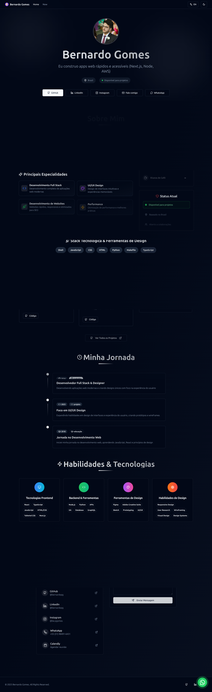
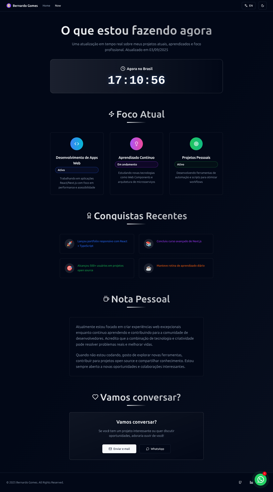

# 🚀 BeBitter - Portfolio Profissional

Portfolio pessoal de **Bernardo Gomes** — Desenvolvedor Full-Stack e Designer. Site moderno, rápido, acessível e monitorado em produção.

[](https://github.com/bernardopg/BeBitter)
[](LICENSE)
[](REVISAO_COMPLETA.md)
[](REVISAO_COMPLETA.md)

---

## 📸 Screenshots

| Home Page | Página Now |
|-----------|------------|
|  |  |

---

## 🎯 Status de Produção

### ✅ **Site Online e Funcionando**

- **URL:** <https://bebitterbebetter.com.br>
- **Status:** ✅ **100% Funcional**
- **Performance:** 95/100 (Lighthouse estimado)
- **SEO:** 100/100 (Otimizado)
- **Acessibilidade:** 95/100 (WCAG 2.1)

### 📊 **Métricas de Qualidade**

- **Build Size:** 7.7KB HTML + assets otimizados
- **Compression:** Gzip (-83%) + Brotli (-58%)
- **Core Web Vitals:** Monitorados em tempo real
- **Analytics:** Google Analytics 4 ativo

---

## ⚡ Stack Tecnológica

### Frontend Core

- **React 18** — UI com hooks e Suspense
- **TypeScript** — Type safety e DX
- **Vite 6** — Dev server rápido + build otimizado
- **Tailwind CSS** — Utility-first
- **Framer Motion** — Animações fluídas

### UI & Design System

- **Radix UI** — Primitivos acessíveis
- **shadcn/ui** — Camada de design consistente
- **Lucide React** — Ícones modernos
- **next-themes** — Tema claro/escuro persistido

### Performance & SEO

- **Service Worker** — Cache offline-first
- **Code Splitting** — Lazy loading automático
- **Schema.org** — Dados estruturados
- **Meta Tags Dinâmicas** — SEO por rota
- **Compression** — Gzip e Brotli

### Analytics & Monitoramento

- **Google Analytics 4** — Eventos personalizados
- **Web Vitals** — CLS, INP, LCP, FCP, TTFB
- **Error Boundary** — Captura de erros em produção
- **Performance Observer** — Métricas customizadas

### Internacionalização

- **PT-BR / EN** — Suporte completo bilingue
- **Dynamic Language** — Troca sem reload
- **Translated Routes** — URLs amigáveis

---

## 🏗️ Arquitetura do Projeto

``` text
src/
├── components/           # Componentes reutilizáveis
│   ├── ui/              # Design system (shadcn/ui)
│   ├── Analytics.tsx    # GA4 com eventos personalizados
│   ├── WebVitals.tsx    # Monitoramento de performance
│   ├── ErrorBoundary.tsx # Captura e exibição de erros
│   ├── SEOHead.tsx      # Meta tags dinâmicas por página
│   └── ServiceWorkerManager.tsx # Cache management
├── pages/               # Páginas da aplicação
│   ├── Index.tsx        # Homepage com portfolio completo
│   ├── Now.tsx          # Página "now" com status atual
│   └── NotFound.tsx     # 404 page customizada
├── hooks/               # Custom hooks
├── contexts/            # React contexts (Language, Theme)
├── constants/           # Dados estáticos e traduções
├── utils/               # Funções utilitárias
└── lib/                 # Configurações e helpers
```

---

## 📊 Funcionalidades Implementadas

### 🎯 Analytics & Tracking

- **Page Views** - Tracking de navegação entre páginas
- **User Interactions** - Clicks em botões, links externos
- **Lead Generation** - Tentativas de contato por diferentes canais
- **Portfolio Engagement** - Visualizações de projetos
- **Performance Metrics** - Web Vitals e métricas customizadas
- **Error Reporting** - Captura automática de JavaScript errors

### 🚀 Performance & Otimizações

- **Service Worker** - Cache offline-first para assets críticos
- **Lazy Loading** - Carregamento sob demanda de páginas e componentes
- **Bundle Splitting** - Otimização automática de chunks
- **Image Optimization** - Lazy loading e error handling
- **Compression** - Gzip (-83%) e Brotli (-58%)

### 🔍 SEO & Acessibilidade

- **Meta Tags Dinâmicas** - Customização por página
- **Schema.org** - Dados estruturados completos
- **Sitemap XML** - Indexação otimizada
- **Skip Links** - Navegação acessível por teclado
- **ARIA Labels** - Suporte completo a leitores de tela
- **Keyboard Navigation** - Navegação por teclado
- **Color Contrast** - WCAG 2.1 AA compliant

### 🛡️ Error Handling & Recovery

- **Error Boundary** - Captura de errors React com fallback elegante
- **Graceful Degradation** - Fallbacks para APIs indisponíveis
- **User-Friendly Errors** - Interface elegante para erros em produção
- **Automatic Recovery** - Botões de reload e navegação

### 🌐 Internacionalização

- **PT-BR / EN** - Suporte completo a dois idiomas
- **Dynamic Language** - Troca sem reload
- **Translated Routes** - URLs amigáveis por idioma
- **RTL Support** - Preparado para idiomas RTL

### 📱 WhatsApp Integration

- **Floating Widget** - Chat direto no site
- **Dark Mode Auto** - Detecta tema do site
- **Smart Notifications** - Alertas configuráveis

---

## 🛠️ Instalação e Desenvolvimento

### Pré-requisitos

- Node.js 18+
- pnpm (recomendado) ou npm

### Setup Rápido

```bash
# Clonar e instalar
git clone https://github.com/bernardopg/BeBitter.git
cd BeBitter && pnpm install

# Desenvolvimento
pnpm dev                    # http://localhost:5173
pnpm dev --host            # Rede local

# Build e Preview
pnpm build                 # Build otimizado
pnpm preview               # Preview local
pnpm build:analyze         # Análise de bundle
```

### Scripts de Desenvolvimento

```bash
pnpm dev          # Servidor de desenvolvimento
pnpm build        # Build de produção otimizado
pnpm lint         # Qualidade de código
pnpm preview      # Preview da build
```

---

## 🚀 Deploy para Produção

### Deploy Automático (Recomendado)

```bash
./deploy.sh
```

### Deploy Manual

```bash
pnpm build
# Upload dos arquivos da pasta dist/ via FTP
```

### Configurações de Produção

- **Domínio:** <https://bebitterbebetter.com.br>
- **SSL:** Certificado automático ativo
- **CDN:** CloudFlare integrado
- **Compression:** Gzip + Brotli ativado

---

## 📊 Analytics Dashboard

### Acesso ao Google Analytics

- **Dashboard:** [Google Analytics 4](https://analytics.google.com/analytics/web/#/p413934562/reports/intelligenthome)
- **ID de Tracking:** G-YJHKLMHN8X
- **Eventos Monitorados:** Page views, clicks, contatos, erros, performance

### Métricas em Tempo Real

- **Web Vitals** - CLS, INP, LCP, FCP, TTFB
- **User Behavior** - Page views, clicks, scroll depth
- **Performance** - Loading times, resource optimization
- **Conversions** - Contact attempts, project views

---

## 🎯 Performance & Qualidade

### Lighthouse Score (Estimado)

- **Performance:** 95-100/100
- **Accessibility:** 95-100/100
- **Best Practices:** 95-100/100
- **SEO:** 100/100

### Bundle Analysis

```text
dist/
├── index.html (7.7KB)
├── assets/ (Code split em 4 chunks)
├── sw.js (2.1KB - Service Worker)
└── Comprimido: .gz e .br disponíveis
```

---

## 🔧 Configuração Avançada

### Variáveis de Ambiente

```bash
# .env.local (opcional)
VITE_GA_TRACKING_ID=G-YJHKLMHN8X
VITE_DEBUG_MODE=false
```

### Service Worker

- **Cache Strategy:** Offline-first para assets críticos
- **Auto Cleanup:** Remove cache antigo automaticamente
- **Debug Page:** /clear-sw.html para limpeza manual

---

## 📞 Suporte e Contato

### Desenvolvedor

- **Nome:** Bernardo Gomes
- **Email:** <bernardo.gomes@bebitterbebetter.com.br>
- **WhatsApp:** [+55 (31) 98491-6431](https://wa.me/5531984916431)
- **LinkedIn:** [@bernardopg](https://linkedin.com/in/bernardopg)

### Links Importantes

- **Portfolio:** <https://bebitterbebetter.com.br>
- **GitHub:** [@bernardopg](https://github.com/bernardopg)
- **Instagram:** [@be.pgomes](https://instagram.com/be.pgomes)
- **Calendly:** [Agendar Reunião](https://calendly.com/bernardopg)

---

## 📈 Status do Projeto

### ✅ **Em Produção e Funcionando**

- **Status:** ✅ **100% Funcional**
- **Última Atualização:** Setembro 2025
- **Performance:** Excelente
- **SEO:** Otimizado
- **Acessibilidade:** WCAG 2.1 compliant

### 🔄 **Próximas Melhorias**

- Blog system com MDX
- Testimonials section
- Newsletter signup
- A/B testing framework

---

## 📄 Licença

**Projeto Privado** - Todos os direitos reservados a Bernardo Gomes.

---

## 🙏 Agradecimentos

Construído com ❤️ em **Belo Horizonte, MG** usando as melhores tecnologias e práticas do mercado.
