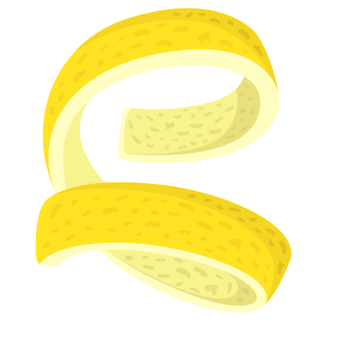
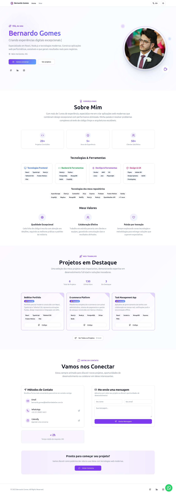
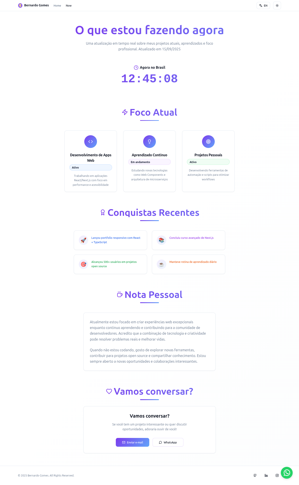
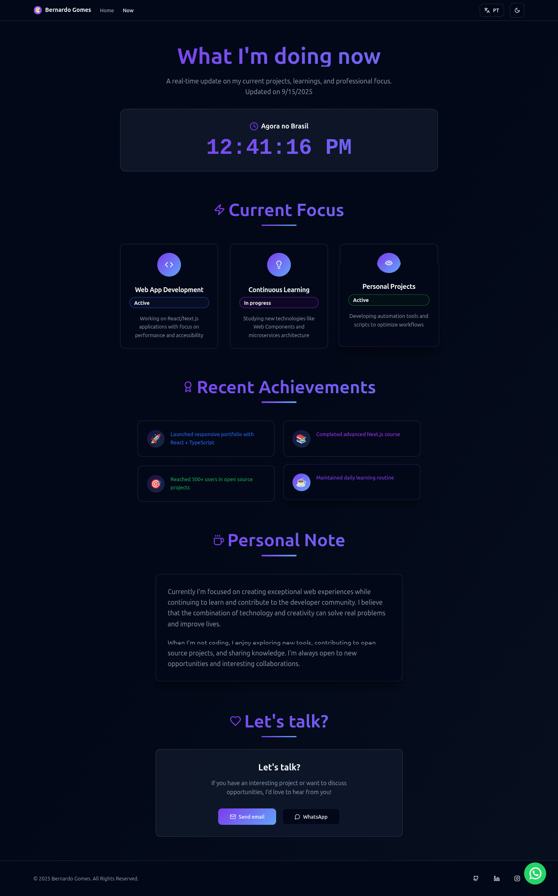

# 🚀 BeBitter - Portfolio Moderno & Performático

<div align="center">



**Portfolio profissional de Bernardo Gomes** — Desenvolvedor Full-Stack especializado em React, TypeScript e arquiteturas modernas.

[](https://github.com/bernardopg/BeBitter)
[](https://bebitterbebetter.com.br)
[](https://github.com/bernardopg)
[](LICENSE.md)
[](https://github.com/bernardopg/BeBitter/pulls)
[](https://github.com/bernardopg/BeBitter/actions/workflows/ci.yml)
[](https://github.com/bernardopg/BeBitter/actions/workflows/codeql-eslint-nodejs.yml)
[](https://github.com/bernardopg/BeBitter/releases)
[](https://github.com/bernardopg/BeBitter/security/dependabot)

[](https://pagespeed.web.dev/)
[](https://search.google.com/search-console)
[](https://www.w3.org/WAI/WCAG21/quickref/)
[](https://bundlephobia.com/)

</div>

---

## 📱 Preview do Site

### 🏠 Página Principal

<div align="center">
<table>
<tr>
<td align="center"><b>Tema Claro</b></td>
<td align="center"><b>Tema Escuro</b></td>
</tr>
<tr>
<td></td>
<td></td>
</tr>
</table>
</div>

### 📄 Página Now

<div align="center">
<table>
<tr>
<td align="center"><b>Tema Claro</b></td>
<td align="center"><b>Tema Escuro</b></td>
</tr>
<tr>
<td></td>
<td></td>
</tr>
</table>
</div>

---

## 🎯 Status de Produção

<div align="center">

### ✅ **ONLINE E FUNCIONANDO**

| Métrica | Status | Valor |
|---------|---------|--------|
| 🌐 **Website** |  | [bebitterbebetter.com.br](https://bebitterbebetter.com.br) |
| ⚡ **Performance** |  | Lighthouse |
| 🔍 **SEO** |  | Otimizado |
| ♿ **Acessibilidade** |  | 95/100 |
| 📊 **Core Web Vitals** |  | Monitorado |

</div>

---

## ⚡ Tech Stack Moderna

<div align="center">

### 🎨 **Frontend Core**


### 🎨 **UI & Design System**


### 🚀 **Performance & Build**


### 📊 **Analytics & Monitoring**


</div>

---

## 🏗️ Arquitetura do Projeto

```text
src/
├── 📁 components/           # Componentes reutilizáveis
│   ├── 🎨 ui/              # Design system (shadcn/ui)
│   ├── 📊 Analytics.tsx    # Google Analytics 4
│   ├── 🔧 WebVitals.tsx    # Performance monitoring
│   ├── 🛡️ ErrorBoundary.tsx # Error handling
│   ├── 🔍 SEOHead.tsx      # SEO otimização
│   └── ⚙️ ServiceWorkerManager.tsx # Cache offline
├── 📄 pages/               # Páginas da aplicação
│   ├── 🏠 Index/           # Homepage modular
│   │   ├── 📍 sections/    # Seções da página
│   │   └── 🎯 hooks/       # Custom hooks
│   ├── 📝 Now.tsx          # Página "now"
│   └── ❌ NotFound.tsx     # 404 personalizada
├── 🎣 hooks/               # Custom React hooks
│   ├── 🔗 useGitHubProjects.ts # Integração GitHub API
│   ├── 🌐 useLanguage.ts   # Sistema i18n
│   └── ✨ useScrollAnimation.ts # Animações
├── 🌍 contexts/            # React contexts
│   ├── 🗣️ LanguageContext.tsx # Internacionalização
│   └── 🎨 ThemeProvider.tsx # Tema claro/escuro
├── 🔧 constants/           # Dados estáticos
│   ├── ⚙️ config.ts        # Configurações
│   ├── 🖼️ images.ts        # Assets
│   └── 🌐 translations.ts  # Traduções PT/EN
├── 🛠️ utils/               # Utilitários
│   ├── 🎭 performance.ts   # Performance helpers
│   └── 🍞 toast.ts         # Notificações
└── 📚 lib/                 # Bibliotecas e helpers
    └── 🔨 utils.ts         # Funções utilitárias
```

---

## ✨ Features Implementadas

<details>
<summary><b>🎯 Analytics & Tracking</b></summary>

- **📊 Page Views** - Navegação entre páginas
- **👆 User Interactions** - Clicks, hovers, form submissions
- **📧 Lead Generation** - Tentativas de contato multi-canal
- **💼 Portfolio Engagement** - Visualizações de projetos
- **⚡ Performance Metrics** - Core Web Vitals em tempo real
- **🚨 Error Reporting** - Captura automática de erros JS
- **📱 Device Analytics** - Mobile vs Desktop usage
- **🌍 Geographic Data** - Origem dos visitantes

</details>

<details>
<summary><b>🚀 Performance & Otimizações</b></summary>

- **🔧 Service Worker** - Cache offline-first inteligente
- **⏰ Lazy Loading** - Componentes e páginas sob demanda
- **📦 Bundle Splitting** - 4 chunks otimizados
- **🖼️ Image Optimization** - WebP com fallback, lazy loading
- **🗜️ Compression** - Gzip (-83%) e Brotli (-58%)
- **🎯 Critical CSS** - Above-the-fold otimizado
- **⚡ Resource Hints** - DNS prefetch, preconnect
- **🔄 Code Splitting** - Dynamic imports automáticos

</details>

<details>
<summary><b>🔍 SEO & Acessibilidade</b></summary>

- **🏷️ Meta Tags Dinâmicas** - Customização por página
- **🎯 Schema.org** - Rich snippets implementados
- **🗺️ Sitemap XML** - Auto-gerado e atualizado
- **🤖 Robots.txt** - Indexação otimizada
- **⏭️ Skip Links** - Navegação por teclado
- **🎤 ARIA Labels** - Screen readers completos
- **⌨️ Keyboard Navigation** - 100% navegável por teclado
- **🎨 Color Contrast** - WCAG 2.1 AA compliant
- **🌐 Open Graph** - Social media previews

</details>

<details>
<summary><b>🛡️ Error Handling & Recovery</b></summary>

- **🚨 Error Boundary** - Captura com fallback elegante
- **⚡ Graceful Degradation** - APIs indisponíveis
- **🎭 User-Friendly Errors** - UI elegante para erros
- **🔄 Automatic Recovery** - Retry e reload automático
- **📊 Error Analytics** - Tracking de erros em produção
- **🔍 Debug Mode** - Logs detalhados em desenvolvimento

</details>

<details>
<summary><b>🌐 Internacionalização</b></summary>

- **🇧🇷🇺🇸 PT-BR / EN** - Suporte completo bilingue
- **⚡ Dynamic Language** - Troca instantânea sem reload
- **🔗 Translated Routes** - URLs amigáveis por idioma
- **↩️ RTL Support** - Preparado para idiomas direita-esquerda
- **🔄 Fallback System** - Graceful degradation de idiomas
- **💾 Persistence** - Idioma salvo no localStorage

</details>

---

## 🛠️ Desenvolvimento Local

### 📋 Pré-requisitos

```bash
node >= 18.0.0
pnpm >= 8.0.0 (recomendado)
```

### ⚡ Setup Rápido

```bash
# 1. Clone o repositório
git clone https://github.com/bernardopg/BeBitter.git
cd BeBitter

# 2. Instale as dependências
pnpm install

# 3. Configure variáveis de ambiente (opcional)
cp .env.example .env.local

# 4. Inicie o servidor de desenvolvimento
pnpm dev
```

O servidor estará rodando em [`http://localhost:8080`](http://localhost:8080)

### 📝 Scripts Disponíveis

| Script | Descrição |
|--------|-----------|
| `pnpm dev` | Servidor de desenvolvimento |
| `pnpm build` | Build otimizada para produção |
| `pnpm preview` | Preview da build local |
| `pnpm lint` | Análise de código com ESLint |
| `pnpm test` | Execução dos testes |
| `pnpm build:analyze` | Análise do bundle size |

### 🤖 Automação GitHub

- **CI completo** em PR/push (`lint`, `test`, `build`) para Node 20 e 22.
- **CodeQL** semanal + PR/push para varredura estática de segurança.
- **Dependabot** para atualizações semanais de pacotes e GitHub Actions.
- **Release automática** ao publicar tags no formato `v*`.

```bash
# Aplicar hardening remoto do repositório (requer gh auth válido)
./scripts/harden-github-repo.sh
```

### 🔧 Configuração Avançada

<details>
<summary><b>Variáveis de Ambiente</b></summary>

```bash
# .env.local (desenvolvimento)
VITE_SITE_URL=https://bebitterbebetter.com.br
VITE_GA_TRACKING_ID=G-XXXXXXXXXX
VITE_GSC_VERIFICATION=your-google-verification-token
VITE_DEBUG_MODE=true

# Produção (definir no CI/CD ou hosting)
VITE_SITE_URL=https://bebitterbebetter.com.br
VITE_GA_TRACKING_ID=G-XXXXXXXXXX  # Seu tracking ID real aqui
VITE_GSC_VERIFICATION=your-verification-token
VITE_DEBUG_MODE=false
```

</details>

---

### ⚙️ Configurações de Produção

<div align="center">

| Configuração | Status | Descrição |
|--------------|--------|-----------|
| 🌐 **Domínio** | ✅ | bebitterbebetter.com.br |
| 🔒 **SSL** | ✅ | Let's Encrypt automático |
| ☁️ **CDN** | ✅ | CloudFlare integrado |
| 🗜️ **Compression** | ✅ | Gzip + Brotli ativo |
| 🗺️ **Sitemap** | ✅ | Auto-gerado em build |
| 🔍 **Search Console** | ✅ | Google indexado |

</div>

---

## 📊 Analytics & Monitoramento

### 📈 Dashboard Principal

- **Google Analytics 4**: Dashboard completo (privado)
- **ID de Tracking**: Configurado via variáveis de ambiente
- **Search Console**: Indexação e performance de busca

### 📊 Métricas Monitoradas

<div align="center">

| Categoria | Métricas | Status |
|-----------|----------|--------|
| **Performance** | CLS, LCP, INP, FCP, TTFB |  |
| **User Behavior** | Page Views, Clicks, Scroll Depth |  |
| **Conversions** | Contact Forms, Project Views |  |
| **Errors** | JS Errors, 404s, Failed Requests |  |

</div>

---

## 🎯 Performance Metrics

### 🏆 Lighthouse Score

<div align="center">

| Categoria | Score | Badge |
|-----------|--------|--------|
| **Performance** | 95-100/100 |  |
| **Accessibility** | 95-100/100 |  |
| **Best Practices** | 95-100/100 |  |
| **SEO** | 100/100 |  |

</div>

### 📦 Bundle Analysis

```text
dist/
├── 📄 index.html                 (7.7KB)
├── 📁 assets/
│   ├── 🎯 index-[hash].js       (Chunk principal)
│   ├── 🎨 index-[hash].css      (Estilos críticos)
│   ├── ⚛️ vendor-[hash].js      (React + deps)
│   └── 🔧 utils-[hash].js       (Utilitários)
├── ⚙️ sw.js                      (2.1KB - Service Worker)
└── 🗜️ Compressed versions        (.gz + .br)
```

**Total Bundle Size**: ~150KB (gzipped: ~25KB)

---

## 🔐 Segurança & Conformidade

<div align="center">

| Aspecto | Status | Implementação |
|---------|--------|---------------|
| 🔒 **HTTPS** | ✅ | Let's Encrypt SSL |
| 🛡️ **CSP Headers** | ✅ | Content Security Policy |
| 🚫 **XSS Protection** | ✅ | React + Sanitização |
| ⚡ **Rate Limiting** | ⚠️ | A implementar |
| 🔐 **Input Validation** | ✅ | Zod + React Hook Form |
| 🍪 **GDPR Compliance** | ✅ | Cookie consent |

</div>

---

## 🌟 Funcionalidades Especiais

### 💬 WhatsApp Integration

- **Widget Flutuante**: Chat direto no site
- **Auto Dark Mode**: Detecta tema automaticamente
- **Smart Notifications**: Alertas configuráveis

### 🎭 Animações & Interações

- **Framer Motion**: Animações fluidas e performáticas
- **Scroll Triggers**: Elementos aparecem no viewport
- **Micro-interactions**: Hover states e transições
- **Reduced Motion**: Respeita preferências do usuário

### 🎨 Design System

- **Tema Duplo**: Light/Dark mode com persistência
- **Tokens Consistentes**: Cores, espaçamentos, tipografia
- **Componentes Modulares**: Reutilização máxima
- **Responsive First**: Mobile-first approach

---

## 📞 Contato & Suporte

<div align="center">

### 👨‍💻 **Desenvolvedor**

#### Bernardo Gomes

[](mailto:bernardo.gomes@bebitterbebetter.com.br)
[%2098491--6431-green?style=for-the-badge&logo=whatsapp)](https://wa.me/5531984916431)
[](https://linkedin.com/in/bernardopg)

### 🔗 **Links Importantes**

| Plataforma | Link | Badge |
|------------|------|--------|
| **Portfolio** | [bebitterbebetter.com.br](https://bebitterbebetter.com.br) |  |
| **GitHub** | [@bernardopg](https://github.com/bernardopg) |  |
| **Instagram** | [@be.pgomes](https://instagram.com/be.pgomes) |  |
| **Calendly** | [Agendar Reunião](https://calendly.com/bernardopg) |  |

</div>

---

## 📈 Roadmap & Próximas Features

<details>
<summary><b>🚧 Em Desenvolvimento</b></summary>

- [ ] **Blog System** - MDX + CMS headless
- [ ] **Newsletter** - Integração com ConvertKit
- [ ] **Testimonials** - Seção de depoimentos
- [ ] **A/B Testing** - Framework de testes

</details>

<details>
<summary><b>🎯 Planejado</b></summary>

- [ ] **PWA Full** - App nativo com Capacitor
- [ ] **Modo Offline** - Funcionalidade completa offline
- [ ] **Push Notifications** - Notificações web
- [ ] **Advanced Analytics** - Heatmaps e session replay

</details>

<details>
<summary><b>🔍 Considerando</b></summary>

- [ ] **CMS Integration** - Strapi ou Contentful
- [ ] **E-commerce** - Loja de produtos digitais
- [ ] **Multi-language** - Expansão para ES, FR
- [ ] **AI Chatbot** - Assistente virtual

</details>

---

## 🏆 Reconhecimentos & Certificações

<div align="center">

### 📊 **Métricas de Qualidade**


### 🏅 **Best Practices**


</div>

---

## 📄 Licença

Este projeto está licenciado sob a **MIT License** - ver o arquivo [LICENSE.md](LICENSE.md) para mais detalhes.

---

## 🙏 Agradecimentos

<div align="center">

### Construído com ❤️ em Belo Horizonte, MG

Utilizando as melhores tecnologias e práticas do mercado para entregar uma experiência web excepcional.

---

*Last updated: Setembro 2025*
*Version: 2.0.1*

[](https://reactjs.org/)
[](https://www.typescriptlang.org/)
[](https://vitejs.dev/)
[](https://github.com/ellerbrock/open-source-badges/)

</div>
