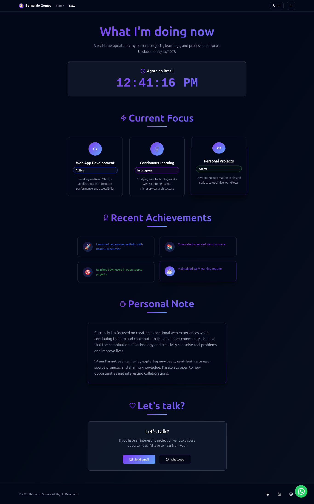

# BeBitter

<div align="center">
  
  <p><strong>Portfolio de Bernardo Gomes</strong><br />React 19, TypeScript, Vite e foco em performance, seguranca e SEO.</p>

  <p>
    <a href="https://bebitterbebetter.com.br"></a>
    <a href="https://github.com/bernardopg/BeBitter/actions/workflows/ci.yml"></a>
    <a href="https://github.com/bernardopg/BeBitter/actions/workflows/codeql-eslint-nodejs.yml"></a>
    <a href="LICENSE.md"></a>
    <a href="https://github.com/bernardopg/BeBitter/commits/main"></a>
  </p>

  <p>
    
    
    
    
    
    
  </p>
</div>

## Visao geral

BeBitter e o portfolio publico de Bernardo Gomes. O projeto entrega uma homepage modular, paginas de servicos e atualizacoes pessoais, catalogo de projetos integrado ao GitHub e paginas detalhadas por repositorio.

O stack principal usa React 19, TypeScript, Vite, Tailwind CSS e TanStack Query. Em producao, o build gera sitemap automaticamente, aplica lazy loading, inlining de CSS critico, compressao gzip/brotli e deploy automatizado via SSH para a Hostinger.

## Preview

<table>
  <tr>
    <td></td>
    <td></td>
  </tr>
  <tr>
    <td align="center">Home · light · pt-BR</td>
    <td align="center">Home · dark · pt-BR</td>
  </tr>
  <tr>
    <td></td>
    <td></td>
  </tr>
  <tr>
    <td align="center">Now · light · pt-BR</td>
    <td align="center">Now · dark · en</td>
  </tr>
</table>

## O que este repositorio cobre

- Site publico com rotas `/`, `/projects`, `/services` e `/now`.
- Paginas de projeto alimentadas pela API do GitHub com cache em cliente.
- Pipeline de qualidade com `lint`, `test`, `build`, CodeQL e Dependency Review.
- Hardening recente para sanitizacao de README HTML e atualizacao de dependencias transitivas vulneraveis.
- Deploy automatizado para Hostinger com backup remoto e verificacao HTTP.

## Stack

| Area | Ferramentas |
| --- | --- |
| Frontend | React 19, React Router 7, TypeScript 5.9 |
| UI | Tailwind CSS 3.4, Radix UI, shadcn/ui, Framer Motion |
| Dados | TanStack Query, GitHub REST API |
| Qualidade | ESLint 9, Vitest 3, Testing Library, CodeQL |
| Build | Vite 6, critical CSS, gzip, Brotli |
| Deploy | SSH + rsync para Hostinger |

## Rotas e sitemap

O sitemap e gerado por `pnpm sitemap:gen` durante o `build` e hoje publica 11 URLs. As rotas principais expostas no arquivo [public/sitemap.xml](public/sitemap.xml) sao:

| Rota | Papel | Prioridade |
| --- | --- | --- |
| `/` | Landing page principal | `1.0` |
| `/projects` | Catalogo de projetos | `0.9` |
| `/services` | Pagina comercial | `0.9` |
| `/now` | Atualizacoes correntes | `0.8` |

O detalhe das URLs geradas, incluindo paginas individuais de projeto, esta em [docs/routes-and-sitemap.md](docs/routes-and-sitemap.md).

## Rodando localmente

```bash
pnpm install
cp .env.example .env.local
pnpm dev
```

Validacoes uteis:

```bash
pnpm ci:check
pnpm security:audit
pnpm build
```

## Deploy

O deploy padrao do projeto publica `dist/` na Hostinger via SSH.

```bash
cp .env.deploy.example .env.deploy
pnpm deploy:hostinger -- --dry-run
pnpm deploy:hostinger
```

Checklist completa em [DEPLOY-CHECKLIST.md](DEPLOY-CHECKLIST.md).

## Documentacao

- [docs/README.md](docs/README.md) - indice da documentacao
- [docs/technical-overview.md](docs/technical-overview.md) - arquitetura, stack e automacao
- [docs/routes-and-sitemap.md](docs/routes-and-sitemap.md) - rotas publicas e estrutura do sitemap
- [SECURITY.md](SECURITY.md) - postura de seguranca e hardening
- [PERFORMANCE-OPTIMIZATION.md](PERFORMANCE-OPTIMIZATION.md) - estrategia de performance
- [SEO-CHECKLIST.md](SEO-CHECKLIST.md) - itens de SEO e indexacao
- [scripts/README.md](scripts/README.md) - scripts de build, deploy e otimizacao

## Contato

- Site: [bebitterbebetter.com.br](https://bebitterbebetter.com.br)
- GitHub: [@bernardopg](https://github.com/bernardopg)
- LinkedIn: [bernardopg](https://www.linkedin.com/in/bernardopg/)
- Email: [bernardo.gomes@bebitterbebetter.com.br](mailto:bernardo.gomes@bebitterbebetter.com.br)

## Licenca

Distribuido sob a [MIT License](LICENSE.md).
